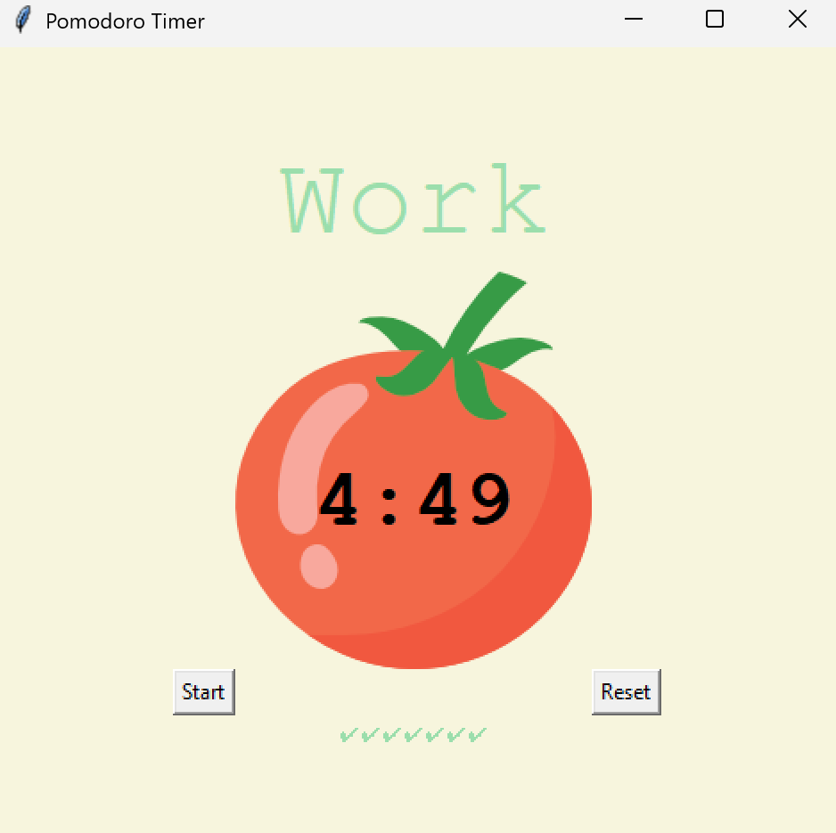
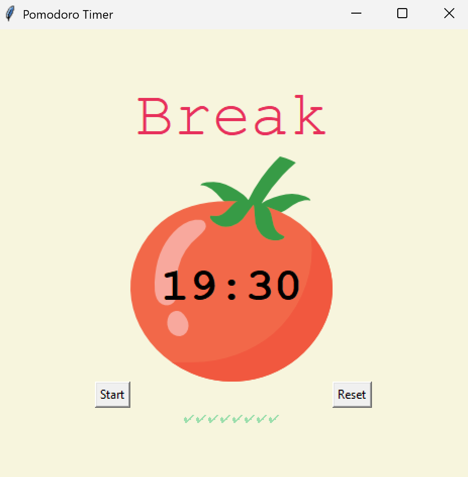

# Timer-Mechanism-Tkinter

A simple Pomodoro timer app built using Python and Tkinter. Helps manage your time using the Pomodoro technique: work in focused intervals with short breaks.

## 🧠 Features

- 25-minute work sessions
- 5-minute short breaks
- 20-minute long breaks after 4 sessions
- Checkmarks to track progress
- Clean UI using Tkinter

## 📷 Screenshot




## 🚀 How to Run

1. Clone the repository:
   ```bash
   git clone https://github.com/your-username/pomodoro-timer.git
   cd pomodoro-timer
